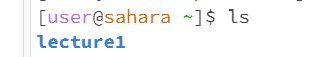
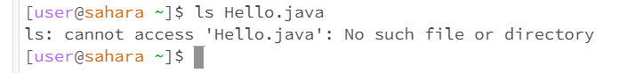
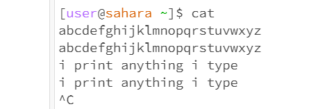

# lab report 1

Zeke Wang 

## command cd
1. no argument

The working directory was /home. There was no output. Since there is no argument the cd command changes the directory back to /home, but as I'm already there, there was no change in the working directory.

3. path to directory

The working directory at the beginning was /home. Using cd with the argument lecture1, there was no output but the working directory was changed to /home/lecture1. 

5. path to file

The working directory was /home/lecture1. Using cd with the argument for a file gave an error message. This error appeared because the current directory did not have the files, hence they could not be accessed.

## command ls
1. no argument

The working directory was /home. The output listed the names of the files in the current directory, lecture1. 

3. path to directory

The working directory was /home. The output listed the names of the files in the directory I specified with the command, and the file names in that directory were printed. 

5. path to file

The working directory was /home. The output gave an error message with a file as an argument. This error occurred because the currently working directory could not access the specified file, which was in another directory, /home/lecture1.

## command cat
1. no argument

The working directory was /home. Using the command with no argument resulted in no output, and the command made the terminal a keyboard that prints what I typed out. 

3. path to directory

The working directory was /home. The output printed information about the directory I provided as the argument. The cat command concatenates the specific argument, but in this case, my argument was a directory and nothing was concatenated, just a message saying my argument was a directory.

5. path to file

The working directory was /home. Using the command with a file as the argument gave an error message. This error occurred because the specified file was not in the currently working directory, hence it was unable to access and concatenate.  
