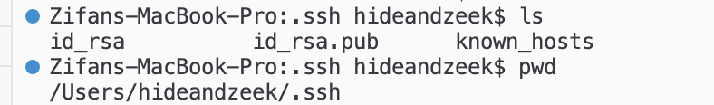
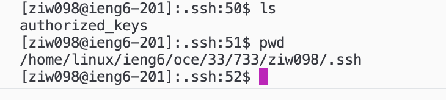

# lab report 2

Zeke Wang

## part 1

code: 
```
import java.io.IOException;
import java.net.URI;

class ChatHandler implements URLHandler {
    String chatLog = "";

    public String handleRequest(URI url) {
        if (url.getPath().equals("/")) {
            return chatLog;
        } else {
            if (url.getPath().contains("/add-message")) {
                String[] parameters = url.getQuery().split("&");
                String user = "";
                String message = "";
                for (String parameter : parameters) {
                    String[] keyValue = parameter.split("=");
                    if (keyValue[0].equals("s")) {
                        message = keyValue[1];
                    } else if (keyValue[0].equals("user")) {
                        user = keyValue[1];
                    }
                }
                if (!user.isEmpty() && !message.isEmpty()) {
                    chatLog += user + ": " + message + "\n";
                }
                return chatLog;
            } else {
                return "404 Not Found!";
            }
        }
    }
}

class ChatServer {
    public static void main(String[] args) throws IOException {
        if(args.length == 0){
            System.out.println("Missing port number! Try any number between 1024 to 49151");
            return;
        }

        int port = Integer.parseInt(args[0]);

        Server.start(port, new ChatHandler());
    }
}
```

screenshots: 


Upon typing the URL, the initial method called is `handleRequest()` within the ChatHandler class. This method handles the incoming URL request. Subsequently, various methods such as `split()`, `replace()`, and `isEmpty()` are called within the `handleRequest()` method to parse the URL query parameters and manipulate strings accordingly. Initially, the chatLog variable within the ChatHandler class is empty. However, after the URL is processed, the value of the message parameter `s` changes from empty to `i had a farm`, and the user parameter changes to `old macdonald`. These values are extracted from the URL query parameters and appended to the chatLog string.


Similar to the first scenario, the chatLog variable within the ChatHandler class is initially empty. However, after processing the URL, the values of the message parameter `s` and user parameter change. Initially, `s` becomes `ee i ee i` and user becomes `kid1`. These values are extracted from the URL query parameters and appended to the chatLog string. Subsequently, another URL request is processed, resulting in the message parameter `s` being changed to `oo` and the user parameter becoming `kid2`. Again, these values are appended to the chatLog string after appropriate processing. As before, within the handleRequest() method, the `+` characters are replaced with spaces to ensure proper formatting of the message and user parameters before they are added to the chatLog.


## part 2
screenshots: 



When I generated an ssh key the output gave me: `Your identification has been saved in /Users/hideandzeek/.ssh/id_rsa` which tells me that my login key is saved as a private file called `id_rsa`. As the screenshot shows, the absolute path to this file is `/Users/hideandzeek/.ssh/id_rsa`.



The public key was copied to my account during lab, therefore it's stored in a file on `ieng6`'s file system. The absolute path to the key is `/home/linux/ieng6/oce/33/733/ziw098/.ssh/authorized_keys`.


This screenshot shows that after typing in `ssh ziw090@ieng6.ucsd.edu`, I logged on without being prompted to type my password. 

## part 3
During the lab, I learned how to generate ssh key and enable access to remote accounts without being prompted to type my password. I was able to do this by first creating a key file and then copying the key to the remote server. I also learned new commands such as `mkdir` and `scp` that allowed me to create new directories to store my key and also securely copy it from my personal computer to the remote server. 
