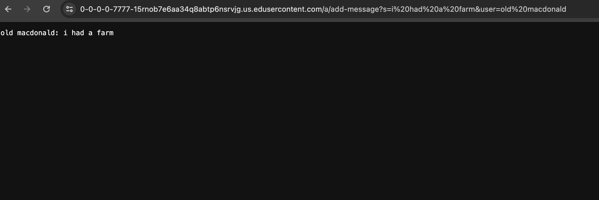
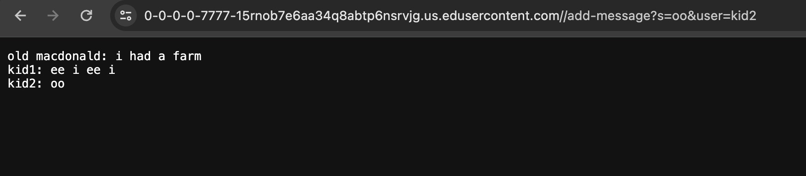

# lab report 2

Zeke Wang

## part 1

```
import java.io.IOException;
import java.net.URI;

class ChatHandler implements URLHandler {
    String chatLog = "";

    public String handleRequest(URI url) {
        if (url.getPath().equals("/")) {
            return chatLog;
        } else {
            if (url.getPath().contains("/add-message")) {
                String[] parameters = url.getQuery().split("&");
                String user = "";
                String message = "";
                for (String parameter : parameters) {
                    String[] keyValue = parameter.split("=");
                    if (keyValue[0].equals("s")) {
                        message = keyValue[1];
                    } else if (keyValue[0].equals("user")) {
                        user = keyValue[1];
                    }
                }
                if (!user.isEmpty() && !message.isEmpty()) {
                    chatLog += user + ": " + message + "\n";
                }
                return chatLog;
            } else {
                return "404 Not Found!";
            }
        }
    }
}

class ChatServer {
    public static void main(String[] args) throws IOException {
        if(args.length == 0){
            System.out.println("Missing port number! Try any number between 1024 to 49151");
            return;
        }

        int port = Integer.parseInt(args[0]);

        Server.start(port, new ChatHandler());
    }
}
```







## part 2

