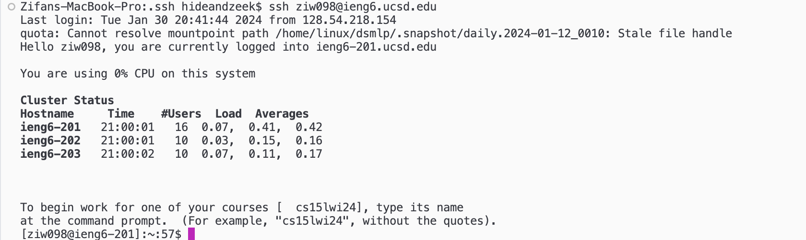

# lab report 2

Zeke Wang

## part 1

code: 
```
import java.io.IOException;
import java.net.URI;

class ChatHandler implements URLHandler {
    String chatLog = "";

    public String handleRequest(URI url) {
        if (url.getPath().equals("/")) {
            return chatLog;
        } else {
            if (url.getPath().contains("/add-message")) {
                String[] parameters = url.getQuery().split("&");
                String user = "";
                String message = "";
                for (String parameter : parameters) {
                    String[] keyValue = parameter.split("=");
                    if (keyValue[0].equals("s")) {
                        message = keyValue[1];
                    } else if (keyValue[0].equals("user")) {
                        user = keyValue[1];
                    }
                }
                if (!user.isEmpty() && !message.isEmpty()) {
                    chatLog += user + ": " + message + "\n";
                }
                return chatLog;
            } else {
                return "404 Not Found!";
            }
        }
    }
}

class ChatServer {
    public static void main(String[] args) throws IOException {
        if(args.length == 0){
            System.out.println("Missing port number! Try any number between 1024 to 49151");
            return;
        }

        int port = Integer.parseInt(args[0]);

        Server.start(port, new ChatHandler());
    }
}
```
screenshots: 


In this screenshot, after I typed in the URL, the first methods called were `handleRequest()` in the `ChatHandler` class which is followed by other methods in the class like `split()`, `replace()`, and `isEmpty()`. The chatlog is initially empty, but after the URL the message parameter `s` changes from empty to `i had a farm` and the `user` changes to `old macdonald`. Finally, the `+` characters from the spaces are replaced with spaces. 


This second screenshot shows the same thing. The same `handleRequest()` method and then `split()`, `replace()`, and `isEmpty()` are called. This time, the parameters are changed to different values; `s` becomes `ee i ee i`, and `user` becomes `kid1`. The same happens later with `s` to `oo` and user to `kid2`. Finally the `+` is changed to spaces. 

## part 2
screenshots: 


My login key is saved as a private file called `id_rsa.pub`. As the screenshot shows, the absolute path to this file is `/Users/hideandzeek/.ssh/id_rsa.pub`.


The public key was copied to my account during lab, therefore it's stored in a file on `ieng6`'s file system. The absolute path to the key is `/home/linux/ieng6/oce/33/733/ziw098/.ssh/authorized_keys`.



This screenshot shows that after typing in `ssh ziw090@ieng6.ucsd.edu`, I logged on without being prompted to type my password. 

## part 3
During the lab, I learned how to generate ssh key and enable access to remote accounts without being prompted to type my password. I was able to do this by first creating a key file and then copying the key to the remote server. I also learned new commands such as `mkdir` and `scp` that allowed me to create new directories to store my key and also securely copy it from my personal computer to the remote server. 
