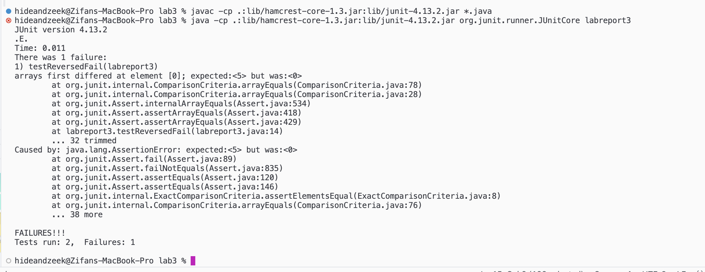
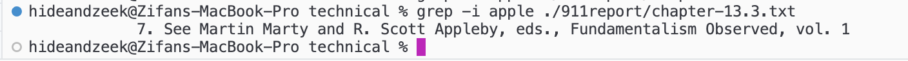
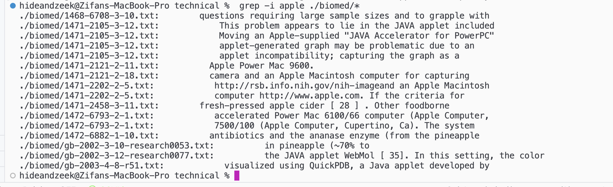
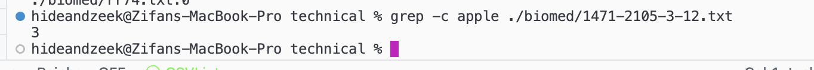
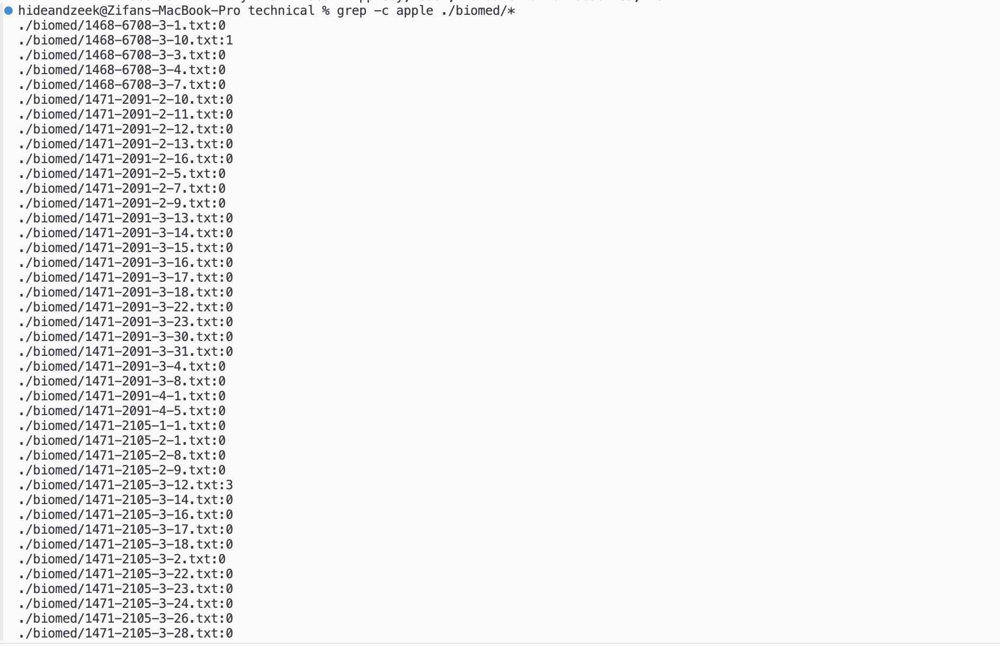
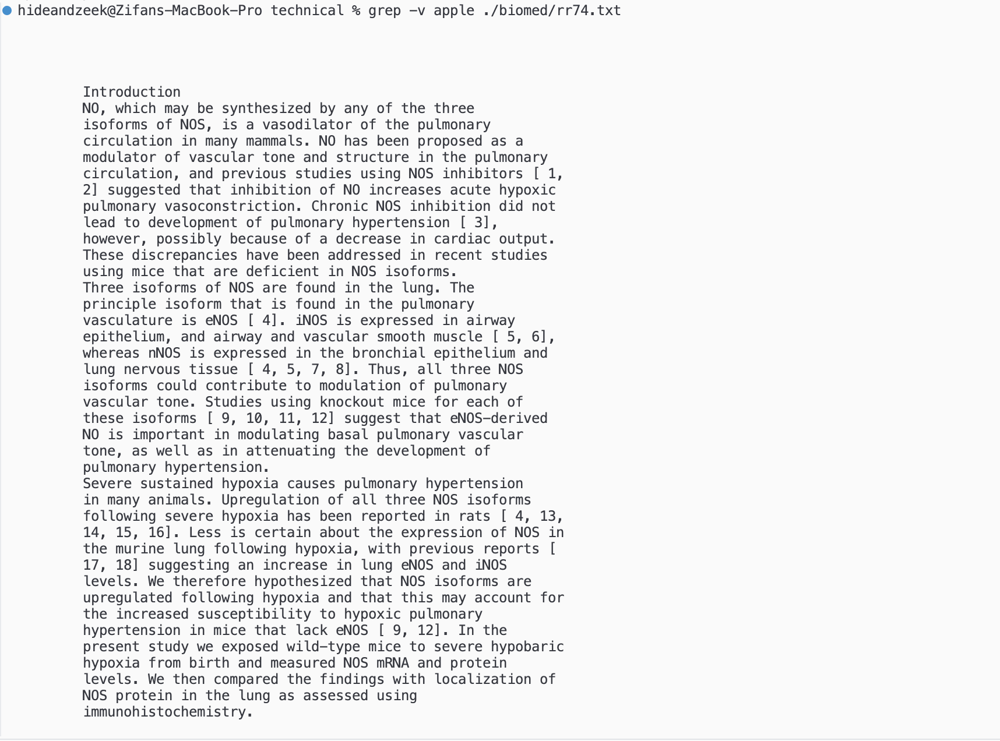
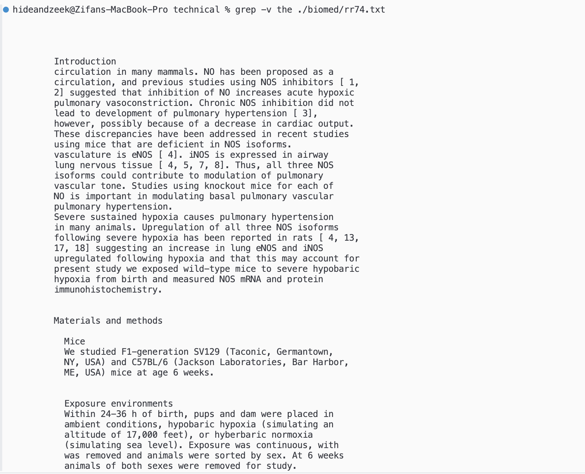
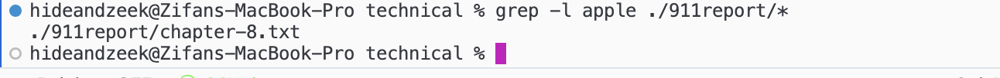
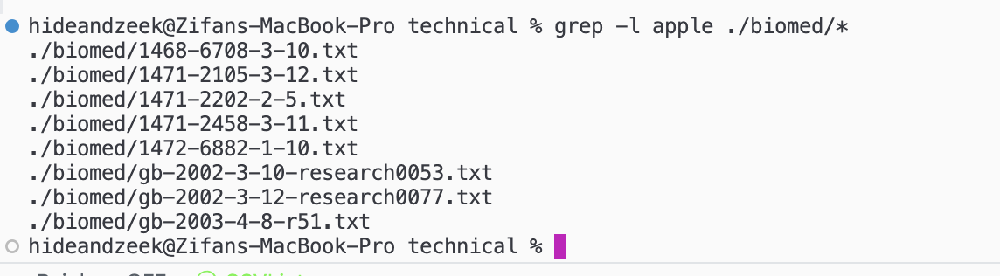

# lab report 3

Zeke Wang

## part 1 - bugs

1. A failure-inducing input for the buggy program, as a JUnit test and any associated code (write it as a code block in Markdown)

```
@Test 
    public void testReversedFail() {
        int[] input1 = { 3, 4, 5 };
        assertArrayEquals(new int[]{ 5, 4, 3 }, ArrayExamples.reversed(input1));
    }
```
  
2. An input that doesn't induce a failure, as a JUnit test and any associated code (write it as a code block in Markdown)

```
@Test 
    public void testReversedNofail() {
        int[] input1 = { 0,0,0 };
        assertArrayEquals(new int[]{ 0,0,0 }, ArrayExamples.reversed(input1));
    }
```

3. The symptom, as the output of running the tests (provide it as a screenshot of running JUnit with at least the two inputs above)



4. The bug, as the before-and-after code change required to fix it (as two code blocks in Markdown)

code before: 
```
static int[] reversed(int[] arr) {
    int[] newArray = new int[arr.length];
    for(int i = 0; i < arr.length; i += 1) {
        arr[i] = newArray[arr.length - i - 1];
    }
    return arr;
}
```
code after: 
```
static int[] reversed(int[] arr) {
    int[] newArray = new int[arr.length];
    for(int i = 0; i < arr.length; i += 1) {
        newArray[i] = arr[arr.length - i - 1];
    }
    return newArray;
}
```
Fix: The bug was in the `reversed()` method where the elements of the new array `newArray` were not correctly assigned. In the original code, the assignment was being done in the input array `arr`. The fix corrects this by assigning the reversed elements from the input array to the new array.

## part 2 - researching commands

command: `grep`

`-i` - 



The `grep -i` command is used to perform a case-insensitive search, meaning it ignores the case of letters when searching for a pattern. This is useful in scenarios where you want to search for a word but are unsure about the case used in the text, making the search more flexible and inclusive.

`-c`



The `grep -c` command is used to count the number of occurrences of a word in a file or directory. This is useful when you need to quickly determine the frequency of a specific word in a file
or directory,

`-v`



The grep -v command is used to print out lines that do not contain the specified word. This is useful when you want to filter out specific lines from a file or text stream. 

`-l`



The grep -l command is used to print only the names of files that contain the specified word. This is useful when you want to quickly identify files that contain a specific word without needing to inspect the content of each file individually.

I found all the ways to use `grep` using `man grep` in my terminal. But I also looked up ways to use grep and picked one from this[website](https://man7.org/linux/man-pages/man1/grep.1.html).
