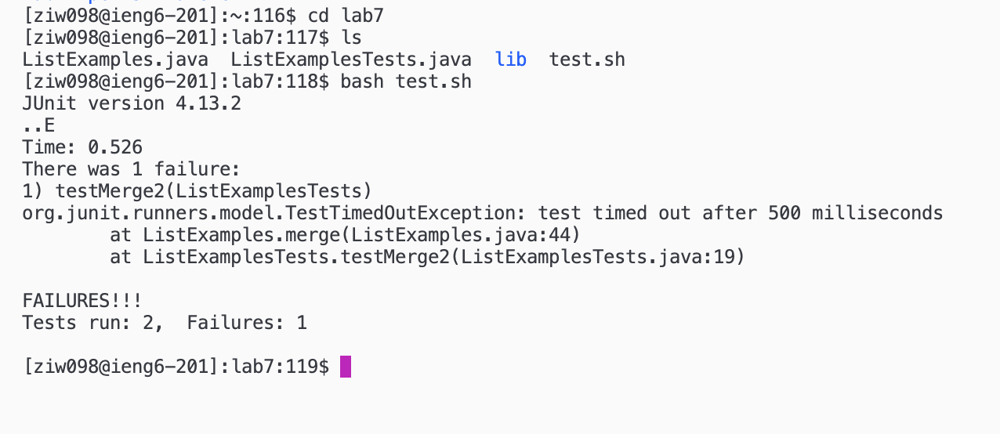
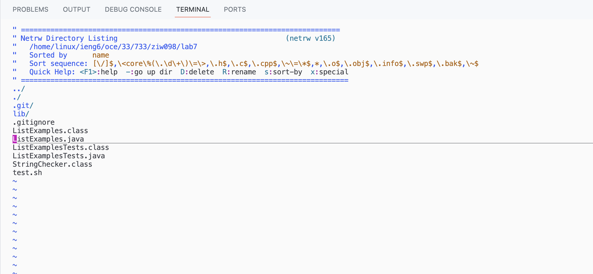
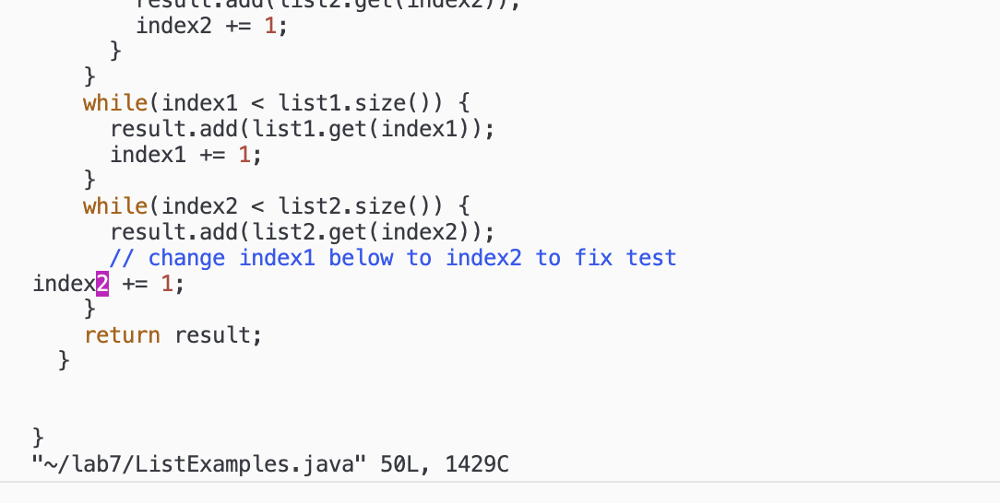
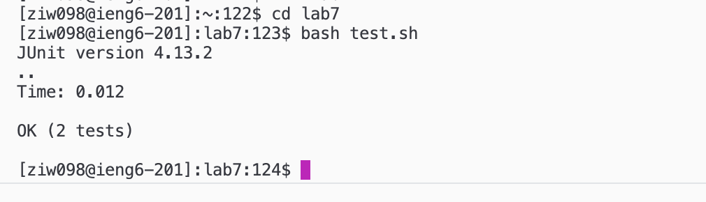

# lab report 4

Zeke Wang


keys pressed/typed: 
1. ```<ssh ziw098@ieng6.ucsd.edu>```
2. ```<enter>``` 

summary: I first logged onto the remote server using the ssh command. 


keys pressed/typed: 
1. ```git clone git@github.com:hideandzeek/lab7.git```
2. ```<enter>```

summary: I cloned the repository ```lab7``` using git clone and the ssh link. 



keys pressed/typed: 
1. ```cd lab7```
2. ```<enter>``` 
3. ```ls```
4. ```<enter>``` 
5. ```bash test.sh```
6. ```<enter>``` 

summary: I change my working directory into ```lab7```, and use the ```ls``` command to check what files I can access, and I ran the provided bash test. 



keys pressed/typed: 
1. ```cd```
2. ```<enter>```
3. ```vim lab7```
4. ```<enter>```
5. ```<j>``` until ```ListExamples.java```
6. ```<enter>```

summary: The test results tell me there is an error, so I changed my working directory back to before where I have access to ```lab7```, and I run ```vim``` on ```lab7```. I pressed ```<j>``` until ```ListExamples.java``` to open the file and fix the bug. 



keys pressed/typed: 
1. ```<j>``` until ```index1```
2. ```<i>``` 
3. ```<backspace>```
4. ```2```
5. ```<escape>```
6. ```:wq```
7. ```<enter>```

summary: I press ```<j>``` until ```index1``` which is labeled to be fixed to ```index2```. I press ```<i>``` to enter insert mode and ```<backspace>``` to remove the 1 and type ```<2>``` on my keyboard to make the variable ```index2```. Then I pressed ```<escape>``` to exit insert mode and typed ```:wq``` to save and exit. 



keys pressed/typed: 
1. ```cd lab7```
2. ```<enter>```
3. ```bash test.sh```

summary: I againchange my working directory into ```lab7``` and run the provided bash test. This time all the tests pass meaning the bug has been fixed. 


