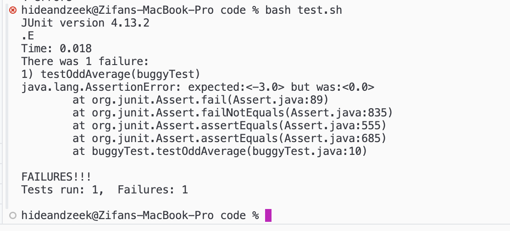
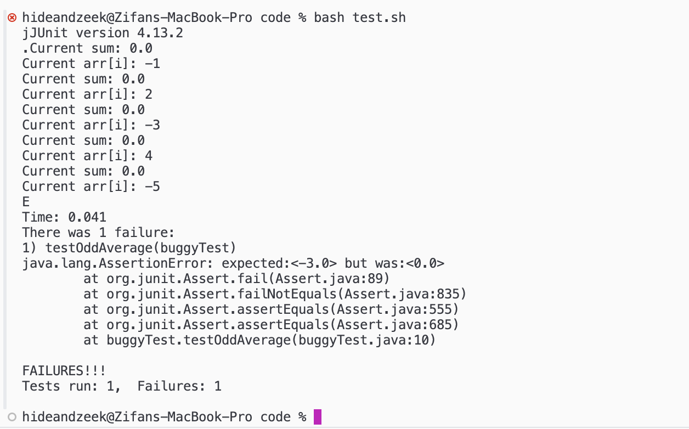
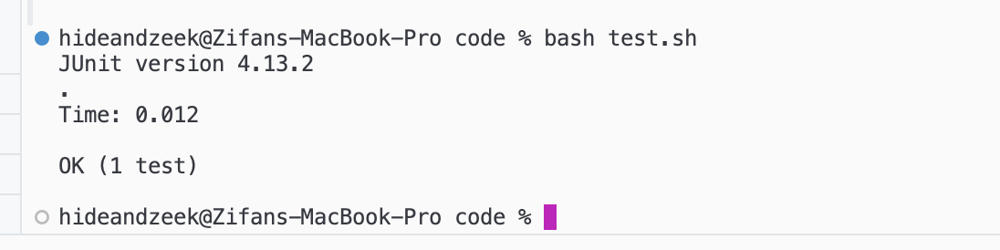

# lab report 5

Zeke Wang

### Part 1

1. Student's original post:

Hello everyone,
I'm working on this java program to find the average of odd numbers in an array. I've written this ```oddAverage``` method in my ```buggy``` class. It's supposed to iterate through the array and sum up all the odd numbers, then return the average. But when I run my JUnit test, it's failing. I'm not sure what's wrong, maybe there is something wrong with my loop or the logic in my method.

code:
```
public class buggy {
    //finds odd numbers and averages them
    public static double oddAverage (int[] arr) {
    double sum = 0;
    for(int i = 0; i < arr.length; i += 1) {
    if(arr[i]%2== 1) {
    sum+= (double) arr[i];
        } 
    }
    return sum/ ((double) arr.length);
    }
}
```
```
import static org.junit.Assert.*;
import org.junit.*;

public class buggyTest {
    @Test
    public void testOddAverage() {
        int[] arr = {-1, 2, -3, 4, -5};
        double result = buggy.oddAverage(arr);
        assertEquals(-3, result,0.001); // Expecting the average of odd numbers
    }
}
```

error screenshot: 



2. TA's response:
Thanks for reaching out. Your suspicion is correct. It seems like your method might not be correctly handling negative odd numbers. Let's try to debug this together. Can you try printing out the values of ```sum``` and ```arr[i]``` inside your loop? It might give us a clue about what's going wrong.


3. Student's follow up:

Thanks for the suggestion. I added some print statements inside the loop as you suggested, and here's the new screenshot of the failing test case:



After adding print statements, it's observed that the loop is not correctly identifying all odd numbers in the array. The issue lies with negative odd numbers not being counted. This is because the condition ```arr[i]%2 == 1``` only identifies positive odd numbers. To fix the bug, modify the condition ```arr[i]%2 == 1``` to ```arr[i] % 2 != 0```. This will correctly identify both positive and negative odd numbers in the array.

Code: 
```
public class buggy {
    //finds odd numbers and averages them
    public static double oddAverage (int[] arr) {
        double sum = 0;
        int oddCount = 0; // New variable to count odd numbers
        for(int i = 0; i < arr.length; i += 1) {
            if(arr[i] % 2 != 0) { // Changed condition to correctly identify odd numbers
                sum += (double) arr[i];
                oddCount++; // Increment odd count
            } 
        }
        return sum / (double) oddCount; // Calculate average based on odd count
    }
}
```

Here is a screenshot that it work without the error:




### Part 2
For me personally, learning Vim was both challenging and rewarding. It was initially confusing and hard to use, but eventually, I realized its efficiency and speed benefits in text manipulation. The minimalist interface, along with extensive customization possibilities, provides a very efficient way to work. Despite the initial difficulty and confusion of using and learning, I think Vim is a very unique and efficient editing system that doesn't require a mouse. This makes it a very valuable skill for developers seeking mastery over their coding environments.

